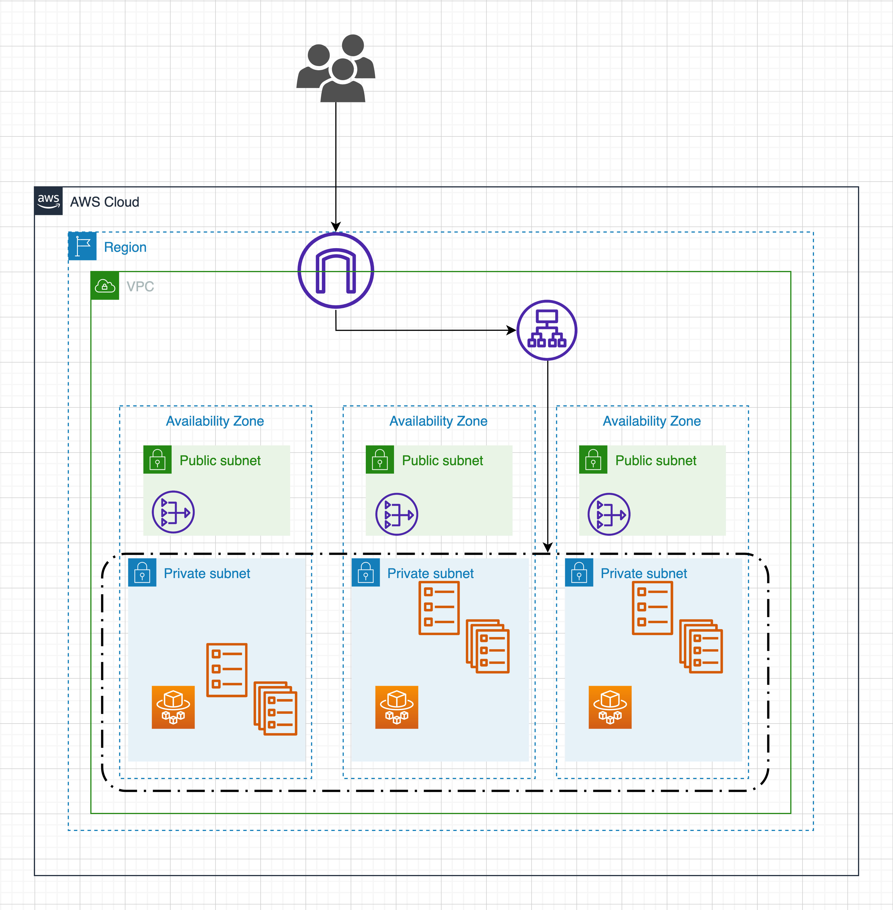

# Task 1 IAC

Secure and reliable deployment demo

## Diagram

#### VPC

| Resource  | CIDR       | Description                |
| :-------- | :----------| :------------------------- |
| `VPC` | `192.0.0.0/16` | For `awsvpc` networking    |

#### Private Subnet

| Zone              | CIDR           | 
| :---------------- | :------------- |
| `ap-southeast-1a` | `192.0.0.0/24` |
| `ap-southeast-1b` | `192.0.1.0/24` |
| `ap-southeast-1c` | `192.0.2.0/24` |

#### Public Subnet

| Zone              | CIDR           | 
| :---------------- | :------------- |
| `ap-southeast-1a` | `192.0.3.0/24` |
| `ap-southeast-1b` | `192.0.4.0/24` |
| `ap-southeast-1c` | `192.0.5.0/24` |
