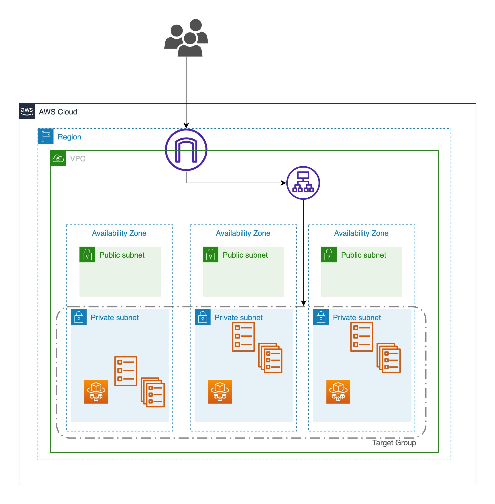

# ECS w\ proper network segmentation and ASG

Secure and reliable deployment demo

## Diagram



#### VPC


| Resource  | CIDR       | Description                |
| :-------- | :----------| :------------------------- |
| `VPC` | `192.0.0.0/16` | For `awsvpc` networking    |

#### Private Subnets

| Zone              | CIDR           | 
| :---------------- | :------------- |
| `ap-southeast-1a` | `192.0.0.0/24` |
| `ap-southeast-1b` | `192.0.1.0/24` |
| `ap-southeast-1c` | `192.0.2.0/24` |

#### Public Subnets

| Zone              | CIDR           | 
| :---------------- | :------------- |
| `ap-southeast-1a` | `192.0.3.0/24` |
| `ap-southeast-1b` | `192.0.4.0/24` |
| `ap-southeast-1c` | `192.0.5.0/24` |

#### Autoscaling

| Desired Capacity | Maximum Capacity | Conditions            |
| :--------------- | :--------------- | :-------------------- |
| `1`              | `5`              | `CPU: 60%`, `Mem: 80%`|


### Pre-requisite

- Install awscli-v2
- Configure with `aws configure --profile personal`
  - Or change `profile` at aws provider configuratoin in `./main.tf`

### Provisioning Infrastructure

1. Initializing modules and s3 backend for tfstate

   ```bash
    terraform init
   ```

2. Generate plan file

   ```bash
    terraform plan -out plan.out
   ```

3. Applying Changes to cloud

   ```bash
    terraform apply plan.out
   ```

---
Output should look something like this,

`elb_dns = "ecs-alb-XXXXXXXX.ap-southeast-1.elb.amazonaws.com"`

If we open the url in the browser that should open -


### Cleanup Project

1. Plan Destroy

   ```bash
    terraform plan -out destroy.out
   ```

2. Apply Changes

   ```bash
    terraform apply destroy.out
   ```
